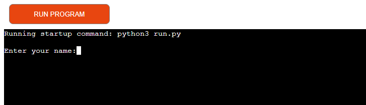
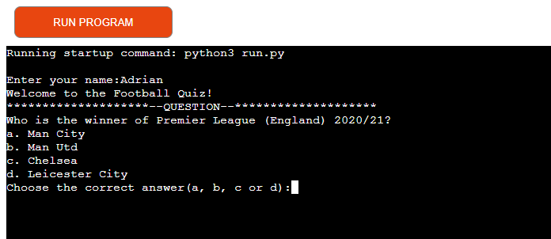
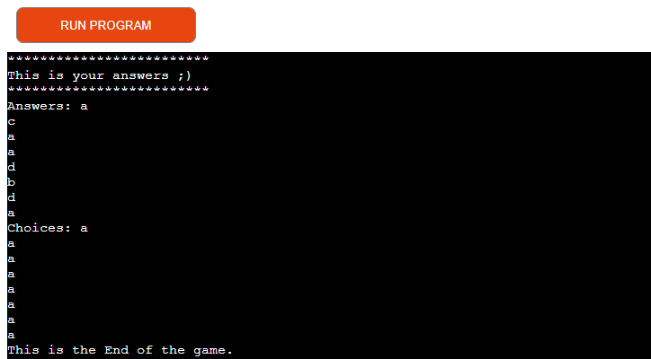
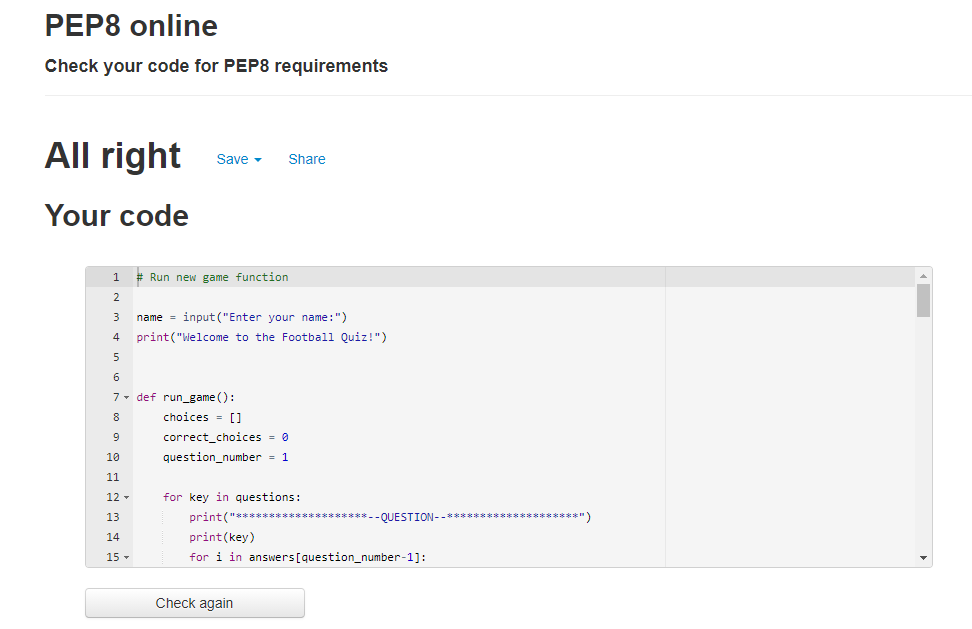

# FOOTBALL-Quizzzzz...!!!

A simple quiz for football lovers as well as for people who want to test their knowledge in this sport discipline. This quiz will allow people to have fun with different questions about their favorite sport.

[Hello good people! I am the link to the application ;)](https://adfootball-quizz.herokuapp.com/)

## Table of Contens
* How to play / Features
* Features left to implement
* Testing
* Validator Testing
* Technologies
* Deployment
* Credits/Reference
* Author Info

#### How to play / Features

Check what you know about football.
1. In this version of the quiz, at the beginning the program asks for a name. 

2. After entering the name and press enter button the welcome message "Welcome to the Football Quiz!" Is displayed. Which allows to start the game.
3. In the next step, the first question is displayed with four possible answers.

4. The player chooses one possible answer from a, b, c, d - options to advance and display the next question.
5. For one correct answer the player gets one point.
6. After all the questions have been answered, a message is displayed comparing the correct answers with the answers given by the player.

7. The player will also get the percentage of answers given and the number of points he has scored.
8. At the end of the game, a question appears. Do you want to start the game again? with the possibility of entering a yes or no options. Answer - yes - means start again, answer - no - end the game.

#### Features left to implement

* Random question 
* Random answers
* The game sholud also include a counter of correct and incorrect answers under each questions.

#### Testing

* Friends helped in testing the website they checked the operation, responsive, accessibility of the application.
* I confirme that this project is responsive, looks good and functions on all standard screen size using the devtools device toolbar.
* Passed the code through a PEP8 python validator and confirmed there is no problems.

#### Validator Testing

* PEP8 python validator
No errors were returned.

#### Technologies

* python3
* Gitpod - Container based development platform. Ready-to-code development environments in the cloud accessible through your browser and your local IDE.
* Github - The most popular of the websites that host Git repositories in the cloud. Thanks to a service like GitHub, we can share our code with other developers and work with them remotely over time.
* Heroku - cloud platform that lets companies build, deliver, monitor and scale apps — we're the fastest way to go from idea to URL, bypassing all those infrastructure headaches.

#### Deployment

Steps for deployment
* Fork or clone this repository
* Create a new Heroku app
* Set the builpacks to - Python and - NodeJS in that order
* Link the Heroku app to the repository
* Click on deploy

#### Credits/Reference

Most of my python code comes from the following YouTube tutorials explaining and showing how to create quizzes from begining.
Of course, I tried to create my unique code completely different from the YouTube tutorials, but it's not that simple. In part, I was able to write somewhat different code.

[Python 5 project in 2 hr.](https://www.youtube.com/watch?v=EFaPsPwPJAY&t=3216s)
[Python quiz game](https://www.youtube.com/watch?v=yriw5Zh406s)
[Making a Quiz Game](https://www.youtube.com/watch?v=cwJBEZjQJtc&t=736s)
[Building a Multiple Choice Quiz](https://www.youtube.com/watch?v=SgQhwtIoQ7o&t=344s)
[How to Make A Simple Game in Python](https://www.youtube.com/watch?v=BDi3SD7E6no)

Acknowledgements Also thank you to the Code Institute slack channel, tutor Kasia and mentor Precious Ijege.

#### Author Info
FabrizioAdi

